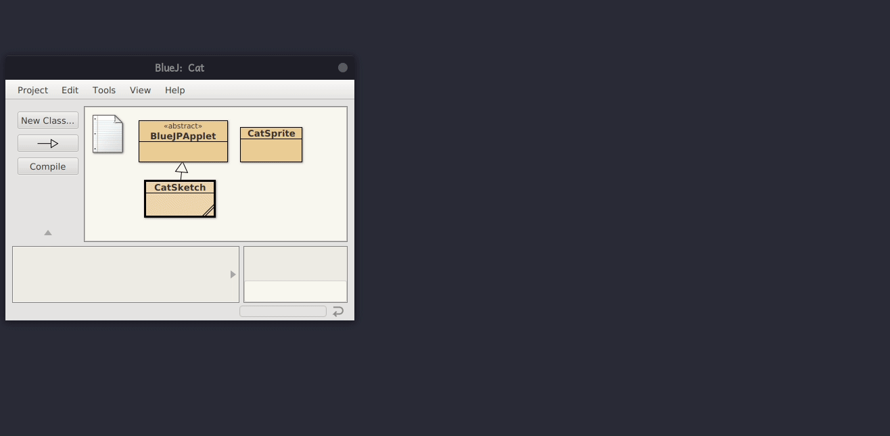
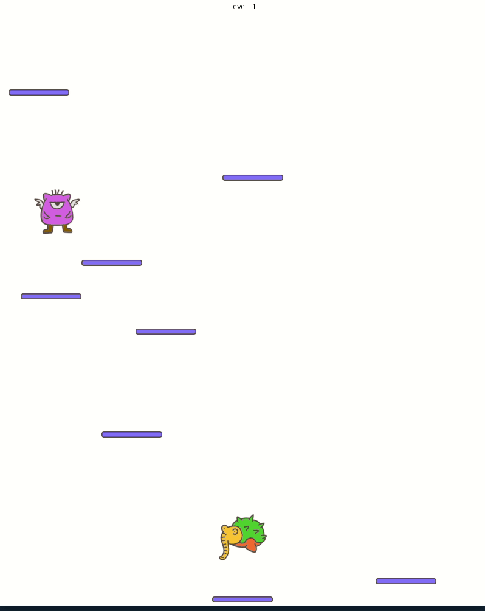

# Processing in BlueJ

## Installation

* Download the suitable libraries for your operating system: https://github.com/mikebarkmin/bluej-processing/releases
* Copy the extracted libraries into a +libs folder or copy them to the bluej userlibs folder (see [How do I use custom class libraries](https://www.bluej.org/faq.html))
* Copy BlueJPApplet into your project
* If you want to use additional processsing libraries copy them also into the +libs folder

## Usage

* Every Processing Sketch should extend BlueJPApplet

## Examples
* Download the examples folder

### Cat

* Additional Processing Libraries: Scratch

Corresponding [Scratch Project](https://scratch.mit.edu/projects/339257357/)

* Open the cat example
* Run the runSketch method of CatSketch
* Inspect the CatSketch object and get the ScratchStage object
* Construct a new CatSprite named cat
* Call the addSprite method of the ScratchStage object with cat
* Call the changeTint method of cat
* Enjoy :smile:

### Halloween

* Additional Processing Libraries: Scratch, Audio

Corresponding [Scratch Project](https://scratch.mit.edu/projects/338613208/)

* Open the halloween example
* Run the runSketch method of HalloweenSketch
* Inspect the HalloweenSketch object and get the Ghost object
* Call the setAnimationInterval method of the Ghost object with 50
* Enjoy :running:

### Jumpy

* Additional Processing Libraries: Scratch

No corresponding Scratch project

* Jump on top of the monsters.
* How long can you survive?
* Control with right and left arrow keys.
* Restart with r.

