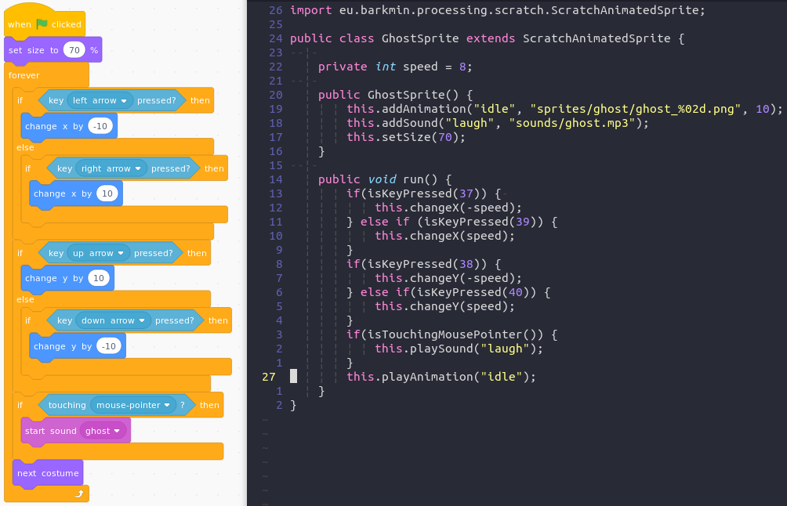
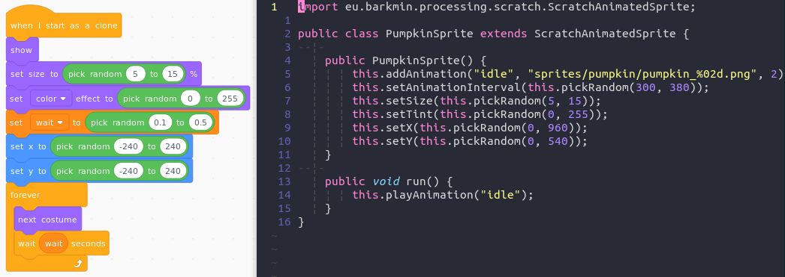
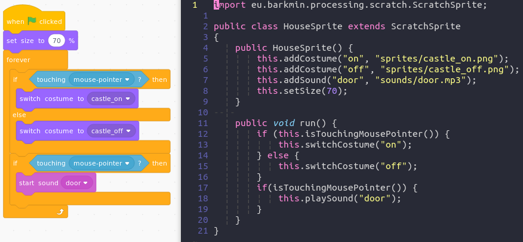

# Halloween

* Additional Processing Libraries: Scratch, Audio

Corresponding [Scratch Project](https://scratch.mit.edu/projects/338613208/)

* Open the halloween example
* Run the runSketch method of HalloweenSketch
* Inspect the HalloweenSketch object and get the Ghost object
* Call the setAnimationInterval method of the Ghost object with 50
* Enjoy :running:

## Comparison

### Ghost

### Pumpkin

### House

